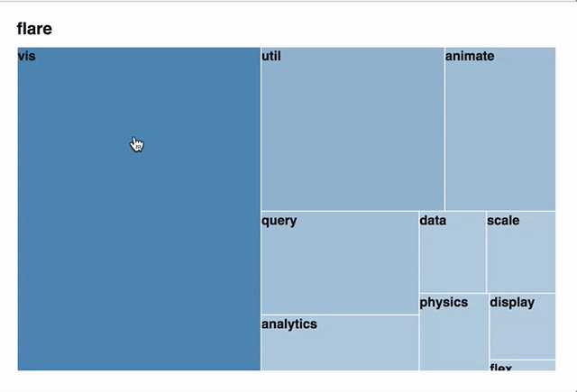

10주차
===

1. [트리 구조](./01_trees.md)
2. [트리맵 1](./02_treemap.md)
3. [트리맵 2](./03_treemap2.md)

## 과제 11 확대축소 트리맵 Zoomable Treemap

1. 트리맵 실습에 사용했던 [flare.json](./sample/flare.json) 파일을 바탕으로 트리맵을 그립니다. 
2. 전체 캔버스 사이즈는 `600X400` 여백은 `{top:40, right:10, bottom: 10, left: 10}`로 지정합니다.
3. 단계별로 바로 `children` 밑에 있는 자식 노드들만 그리고, 특정 노드를 클릭시 해당 노드가 가진 자식 노드들을 그리도록 합니다. 자식 노드가 없는 경우 변화하지 않습니다. 개별 노드의 크기는 `size` 값을 합산하여 계산합니다. 
4. 상단에 현재 레벨의 `name`을 `.`로 끊어 표현해주고, 클릭시 이전 단계 레벨로 다시 이동합니다.
5. 자식 노드에는 해당 노드의 `name` 값을 적어줍니다. 노드의 크기를 넘어서지 않도록, 클리핑 합니다.
5. 배경 색상은 `steelblue`로 통일하고, 현단계의 노드의  도메인으로 해서 투명도를 `[0.4, 1.0]` 사이에서 조정합니다. 
6. 트리맵 간격 `padding` 값을 1로 지정합니다.

---

- 제출마감 : `2018-05-18 (금) 18:00`
- 제출방법
 - [제출 폴더](https://www.dropbox.com/request/ozcsL3ejIFQrgNvczvdt)
 - 제출명 : 파일명 `이름-학번.zip` (예: honggildong-2013.zip)
 - 제출물 :
   - 결과물은 `index.html, index.js` 에 모두 작성합니다. (별도의 스크립트를 작성후 연결해도 좋습니다.)
   - 결과물 파일(`index.html`, `index.js`, `flare.json`)은 모두 `honggildong-2013` 폴더에 넣은 후 압축하여 업로드 합니다.
   - d3 이외의 외부 라이브러리의 사용은 금합니다.